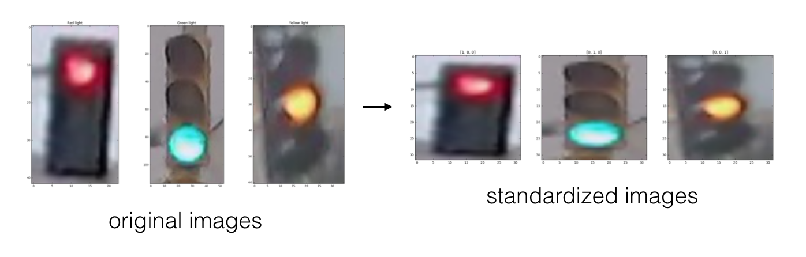

# Traffic Light Classifier

## Introduction
The **Traffic Light Classifier** project utilizes computer vision techniques to classify images of traffic lights, identifying which light—red, yellow, or green—is illuminated. Using a provided dataset of traffic light images, we'll develop a robust classifier to categorize these images into three distinct categories.
  

## Classification Steps
The classifier is built using a systematic approach, breaking down the process into five key sections:

1. **Loading and Visualizing Data**  
   We'll begin by loading the traffic light images and visualizing the dataset. This initial exploration helps familiarize us with the data and gives insight into how the images are structured.

2. **Pre-processing**  
   The images and labels need to be standardized for consistent analysis. We'll resize the input images to a uniform size and convert the output labels into numerical values. This step ensures all input data can be processed uniformly.
   

3. **Feature Extraction** is crucial for distinguishing traffic light colors. We'll extract key features from the images—transforming them into 1D vectors or simplified values that encapsulate the relevant information for classification.
   

4. **Classification & Visualizing Error**  
   Using the extracted features, we'll implement a function that classifies the traffic light images. This function will predict the traffic light's color, and we'll compare the predictions to actual labels, visualizing any errors in classification.

5. **Model Evaluation**  
   To ensure accuracy, the classifier must achieve at least 90% accuracy, with no misclassification of red lights as green. We'll iteratively improve the model by adjusting and adding features, aiming for as close to 100% accuracy as possible.

## Helper Functions and Testing
The repository includes additional files like `helpers.py` and `test_functions.py` to support data loading and code testing. These helper functions will streamline the process and help validate the classifier's performance.

## Technology Stack
- **Programming Language:** Python  
- **Environment:** Jupyter Notebook  
- **Libraries:** OpenCV, Machine Learning algorithms  
- **Techniques:** Data Visualization, Feature Extraction, Image Processing